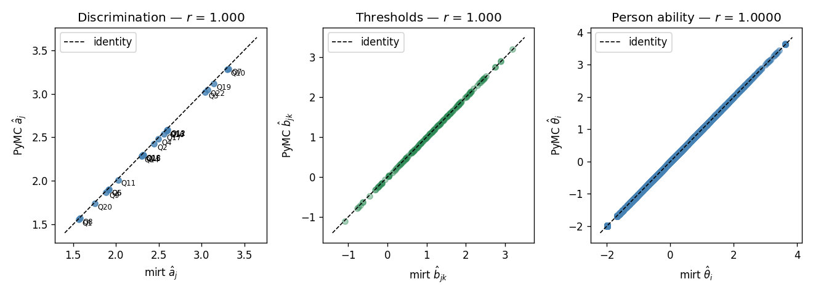

# Graded Response Model (GRM) using PyMC and mirt

## RWAS dataset

### Dataset:

- https://openpsychometrics.org/_rawdata/RWAS.zip
- https://openpsychometrics.org/tests/RWAS/

### Implementation:
- PyMC: [rwas-pymc.ipynb](./rwas-pymc.ipynb)
- mirt: [rwas-mirt.Rmd](./rwas-mirt.Rmd)
    - ref. https://onlinelibrary.wiley.com/doi/10.1002/ijop.13265

### Result:

The estiamtes would be almost the same:

[compare-params.ipynb](./compare-params.ipynb)

